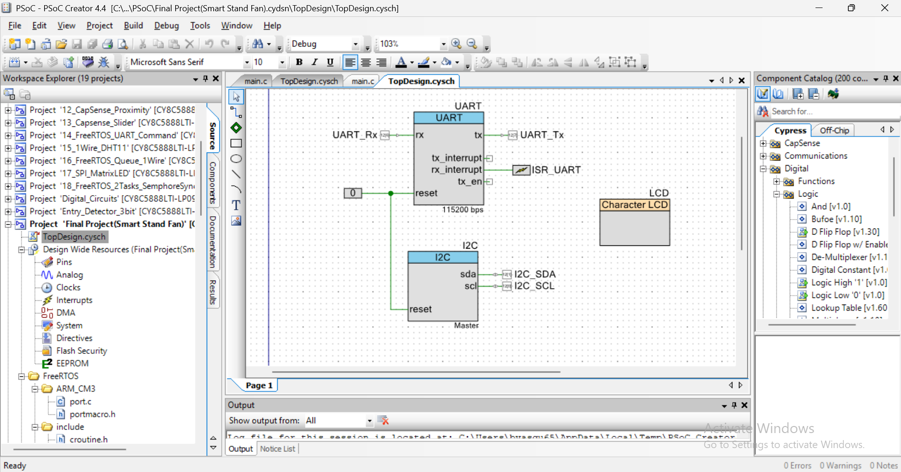
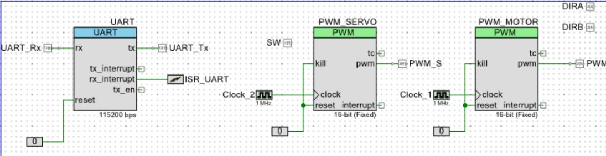

# Smart-Fan-System

## Description
This project implements a smart fan control system using two PSoC microcontrollers and FreeRTOS. The system automatically adjusts the fan’s DC motor speed based on time data from an RTC module, while the servo motor operates independently to provide continuous sweeping motion. The project demonstrates real-time multitasking, UART communication between microcontrollers, and modular embedded system design.

## System Architecture 
The system is divided into two independent functional units:

1. Sensor Unit (PSoC #1)
   
- Interfaces with a Real-Time Clock (RTC) module to read the current time.
- Implements time-based control logic to determine the appropriate fan speed.
- Sends RTC-based motor control commands to the motor control unit via UART.

2.  Motor Control Unit (PSoC #2)

- Receives RTC-based control commands over UART.
- Controls the DC motor speed using PWM, based only on commands received from the sensor unit.
- Controls a servo motor independently, providing continuous left-to-right sweeping motion.

## Hardware Components 
- 2 PSoC5LP microcontollers 
- DS3231 RTC Module
- DC Motor
- Motor Driver (L298N)
- Servo Motor
- Resistors
- Breadboard and Jumper Wires

## Top Design PSoC 1
 

## Top Design PSoC 2
 
